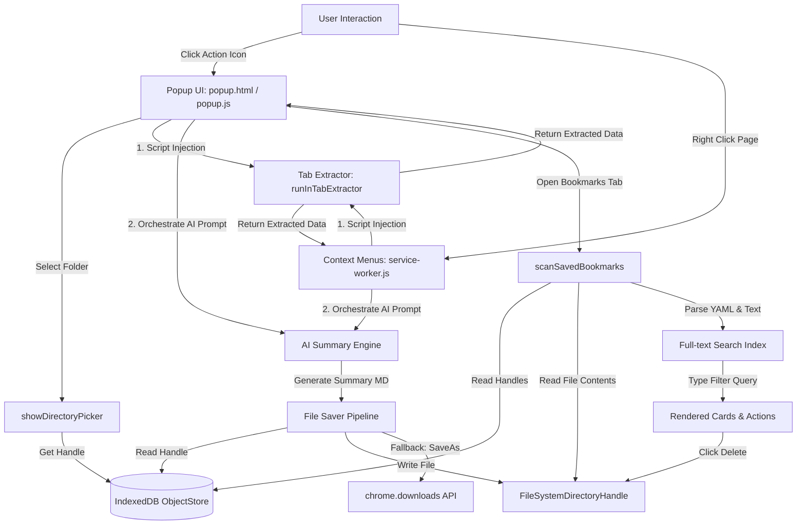

# Markdown Clipper 📝🤖🔍

**Markdown Clipper** is a premium, offline-first Manifest V3 Chrome Extension that extracts web page content, generates AI summaries, and saves them directly as Markdown files into a user-selected local directory (such as an Obsidian Vault). It also features an offline full-text search engine inside the popup to query, open, and manage your clipped bookmarks.

---

## 🚀 Key Features

*   📁 **Direct Directory Saving (Obsidian Vault Integration)**: Bypasses the browser's generic downloads folder using the **File System Access API**. Saves files silently directly to your personal knowledge base (Obsidian, Logseq, Notion, Hugo, etc.).
*   🔄 **Persistent Handles (IndexedDB)**: Persists your selected directory handle across browser sessions so you don't have to choose the folder every time you open the extension.
*   🤖 **Triple-Engine AI Summarization**:
    *   **Local Gemini Nano**: Utilizes Chrome's built-in `LanguageModel` API for completely offline, zero-cost summaries.
    *   **Cloud Gemini API**: Streams high-quality responses from Gemini 2.5 Flash (requires a user-configured API key).
    *   **Extractive Fallback**: Fast, local heuristic extraction of page descriptions, key headings, and lead paragraphs when offline or AI services are unavailable.
*   🔍 **Local Bookmark Search Engine**: Reads and parses all saved `.md` bookmarks in your target folder, indexing YAML front matter fields (Title, URL, description, author, tags) and summary bodies for real-time full-text search.
*   🖱️ **Resilient Background Context Menus**: Right-click anywhere to "Clip Summary of Page" or "Clip Summary of Selection". Integrates direct folder writes, and gracefully falls back to the Chrome Downloads API if directory permissions require user re-verification.
*   🎨 **Premium Glassmorphic Design**: Sleek dark-slate glassmorphism styled with custom CSS (`Outfit` typography, status indicators, animated stream preview accordions, tag badges, and notifications).

---

## 🛠️ Architecture Flow



---

## 📂 Project Directory Structure

```text
markdown-clipper/
├── manifest.json            # Manifest V3 extension configuration
├── package.json             # Node commands and testing dependencies
├── vitest.config.js         # Vitest runner config (jsdom sandbox)
├── .gitignore               # Excluded dependency logs and folders
├── README.md                # Project documentation
├── CHROMEWEBSTORE.md        # Store listing draft & permission justifications
├── generate_icons.py        # Icon generator utility script
│
├── background/
│   └── service-worker.js    # Context menus, background tasks, downloads fallback
│
├── content/
│   └── content.js           # Scrapes title, tags, description, selections, and DOM contents
│
├── libs/
│   └── turndown.js          # Offline HTML-to-Markdown parser
│
└── popup/
    ├── popup.html           # Three-tab popup UI structure (Clip, Bookmarks, Settings)
    ├── popup.css            # Premium glassmorphic interface styles
    ├── popup.js             # Main frontend controller and scanner
    ├── utils.js             # Pure, modular utility functions
    └── utils.test.js        # Vitest test suite covering utilities
```

---

## 📦 Installation & Configuration

### 1. Load the extension in Chrome
1. Open Google Chrome and navigate to `chrome://extensions/`.
2. Turn on **Developer mode** in the top right corner.
3. Click **Load unpacked** in the top left.
4. Select the project directory (`/Users/ish/.gemini/antigravity/scratch/markdown-clipper`).

### 2. Configure Gemini Nano (Local Offline AI)
To enable the built-in Chrome AI summary engine:
1. Ensure you are on a recent version of Chrome (Chrome 128+).
2. Go to `chrome://flags/#optimization-guide-on-device-model` and set it to **Enabled BypassPrefRequirement**.
3. Go to `chrome://flags/#prompt-api-for-gemini-nano` and set it to **Enabled**.
4. Relaunch Chrome.
5. Open a web page, click the extension icon, choose **Chrome Built-in AI (Gemini Nano)** in the settings, and wait for Chrome to download the model (indicated in the popup status).

---

## 💻 How to Use

### Direct Directory Saving (Settings Tab)
1. Go to the **Settings** tab inside the extension popup.
2. In the **Local Save Directory** card, click **Select Folder / Obsidian Vault**.
3. Select your desired local directory and click **Allow** when Chrome prompts you.
4. Check the **Save directly to folder** box.
5. Open an article, verify metadata fields, and click **Download Summary Markdown**. The file will write directly and silently to disk.

### Bookmarks Full-Text Search (Bookmarks Tab)
1. Switch to the **Bookmarks** tab.
2. Click **Grant Folder Access** (if the browser session has restarted and expired permissions).
3. The extension scans your folder for all `.md` files and extracts the YAML front matter.
4. Type in the search bar to filter bookmarks dynamically by title, tags, description, or summary body content.
5. Click the original link icon to launch the page or the delete icon to remove the file directly from your local disk.

---

## 🧪 Running Unit Tests

Automated testing is implemented using **Vitest** with a **jsdom** configuration to test state-free utilities without relying on active browser tabs.

1. Install project dependencies:
   ```bash
   npm install
   ```
2. Run the test suite:
   ```bash
   npm run test
   ```

The unit test suite will evaluate:
*   `escapeYamlString`: Handles double-quote replacements and default null values.
*   `formatFilename`: Validates all patterns (Title-only, Title-Date, Domain-Title, Date-Title) and collapses special characters safely.
*   `parseBookmarkContent`: Validates YAML property extractions (tags lists, descriptions, title) and extracts clean body text.

---

## 🛡️ License

This project is open-source and available under the [MIT License](LICENSE).
